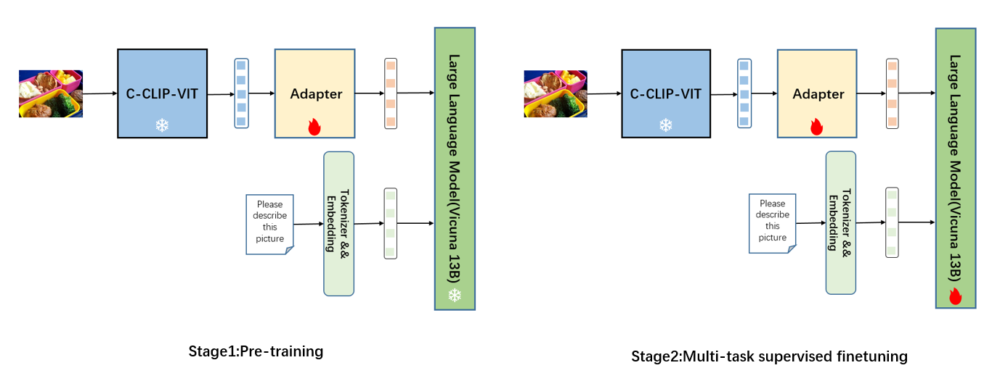

# CVLM

CVLM: A Multimodal VLLM

## Framework



## Evaluate

### MME

```
model_path=ToOverwrite # trained model to replace  
image_path=MME_Path # MME testset path  
bash scripts/evaluation_mme.sh $model_path $image_path  

```

## Acknowledgement

[CLIP](https://github.com/openai/CLIP)  
[MiniGPT-4](https://minigpt-4.github.io/)   
[LLaVA](https://github.com/haotian-liu/LLaVA)  
[Vicuna](https://github.com/lm-sys/FastChat)  


Copyright © 2023 CVLM 

